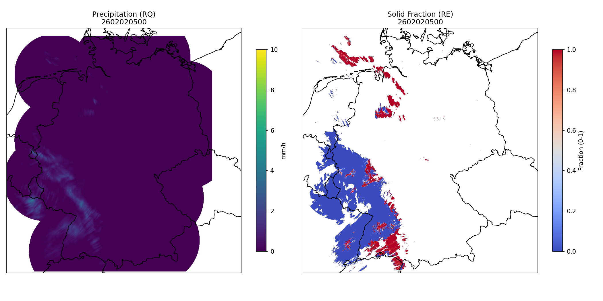
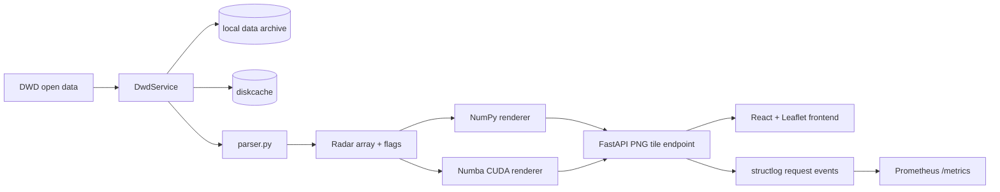

# Radarmap



Radarmap is an inspectable radar-map pipeline for [German Weather Service (DWD) RADVOR radar open data](https://opendata.dwd.de/weather/radar/radvor/). It fetches radar products, parses them into arrays, renders
XYZ PNG map tiles, and exposes request timing through structured logs and
Prometheus metrics.

The project is mainly an engineering study and benchmark. Its main purpose is to evaluate server-side CPU and CUDA-based tile rendering and analyze involved overheads.

## Features

- Backend: FastAPI tile API with DWD download, local archive reuse, disk cache,
  RADVOR data parsing, and Prometheus metrics.
- Frontend: React + Leaflet map using the backend tile endpoint
- Renderers: portable CPU path using NumPy/PyProj and optional GPU path using
  Numba CUDA kernels
- Benchmarks: warmed local HTTP tile benchmark comparing CPU and CUDA renderers

## Architecture



## Repository Layout

| Path | Purpose |
| :--- | :--- |
| `radarmap-backend/` | FastAPI backend, parser, renderers, services, tests. |
| `radarmap-frontend/` | React/Leaflet frontend. |
| `docs/` | MkDocs documentation and generated images. |
| `benchmarks/` | CPU/GPU benchmark sweep, GPU transfer helper, and benchmark CSV. |
| `scripts/` | Utility scripts, including DWD sample download helpers. |
| `data/` | Local radar archives. Ignored by Git except documentation. |
| `cache/` | Runtime disk cache. Ignored by Git. |

## Local Run

Prerequisites:

- Python 3.10 or newer
- Node.js 18 or newer
- `uv`

Install dependencies:

```bash
uv sync
npm --prefix radarmap-frontend install
```

Run both services together:

```bash
npm run dev
```

Or run them in separate terminals:

```bash
npm run backend
npm run frontend
```

The frontend runs at `http://localhost:5173`; the backend runs at
`http://127.0.0.1:8000`.

The backend can download current DWD data on demand. Downloaded archives are
stored under `data/<product>/` and are intentionally ignored by Git. For a local
sample archive, use:

```bash
uv run python scripts/download_radvor.py
```

## Benchmarks

`benchmarks/run_benchmarks.py` is the benchmark used for the published CPU/GPU
latency table. It drives the HTTP tile endpoint, warms each renderer path, and
writes `benchmarks/benchmark_results.csv` plus charts under `docs/images/`.

Example results on a 2021-vintage laptop:

| Tile size | Interpolation | CPU NumPy | Numba CUDA | Speedup |
| :--- | :--- | ---: | ---: | ---: |
| 256px | nearest | 12.56 ms | 8.74 ms | 1.4x |
| 256px | bilinear | 12.89 ms | 8.32 ms | 1.5x |
| 512px | nearest | 33.71 ms | 12.44 ms | 2.7x |
| 512px | bilinear | 34.55 ms | 13.83 ms | 2.5x |
| 1024px | nearest | 113.00 ms | 27.73 ms | 4.1x |
| 1024px | bilinear | 123.96 ms | 27.51 ms | 4.5x |
| 2048px | nearest | 436.22 ms | 81.69 ms | 5.3x |
| 2048px | bilinear | 473.87 ms | 81.69 ms | 5.8x |

These numbers are local measurements for one selected product/tile shape, i.e. they compare renderer behavior on one set of laptop hardware. 

## Observability

The backend exposes Prometheus metrics at `/metrics` and structured request logs
through `structlog`.

Currently documented signals include:

- tile request count
- active request count
- tile render latency by product and tile size
- tile render failures
- data acquisition latency
- cache hit/miss behavior

See [docs/telemetry.md](docs/telemetry.md) for metric names and interpretation.

## Caveats

- No `docker compose up` path exists yet; the current runnable path is the local
  backend/frontend dev workflow above
- The CPU renderer is the portable default; the CUDA renderer is an optional acceleration path for compatible local machines
- The frontend currently requests default 256px PNG tiles; large tile sizes in the benchmark are stress cases

## Documentation

Detailed notes live in `docs/`:

- [Architecture](docs/architecture.md)
- [Rendering](docs/rendering.md)
- [Performance](docs/performance.md)
- [Telemetry](docs/telemetry.md)

## License

MIT. See [LICENSE](LICENSE).
