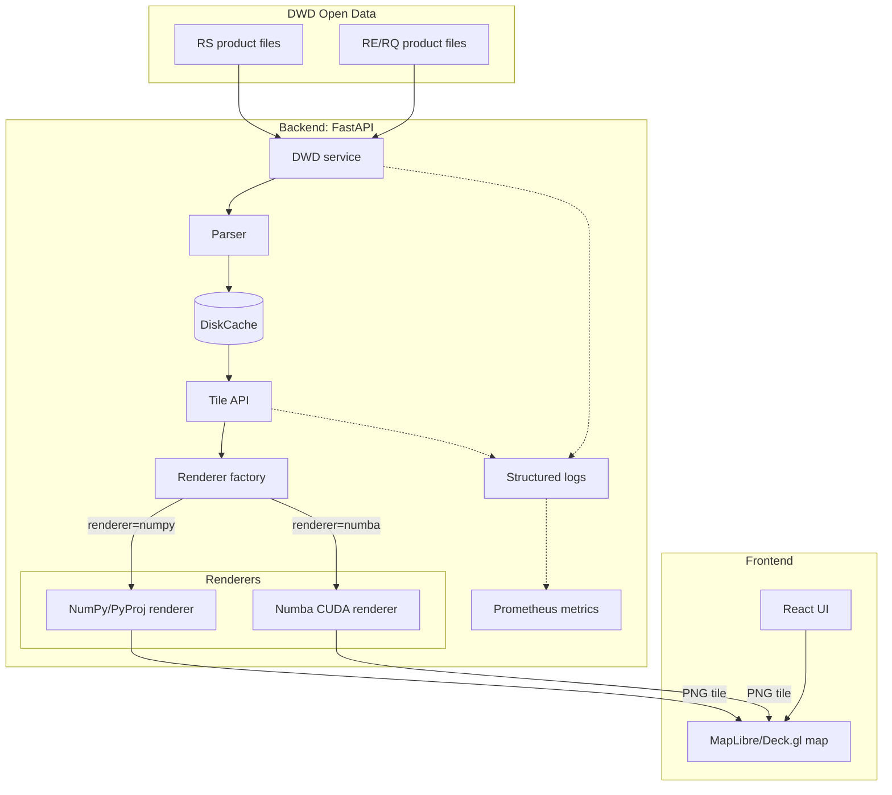

# Project Structure and Data Flow

This diagram shows the main runtime components involved in serving a radar
tile. It omits development scripts and benchmark-only files.

The backend is responsible for radar data access, parsing, caching, tile bounds,
renderer selection, and PNG serialization.

Both renderers use inverse mapping: each output pixel is mapped back into the
source radar grid. This avoids gaps in the output tile and makes CPU/GPU results
easier to compare.

Telemetry is derived from structured log events. Selected event fields are
converted into Prometheus counters, gauges, and histograms.
