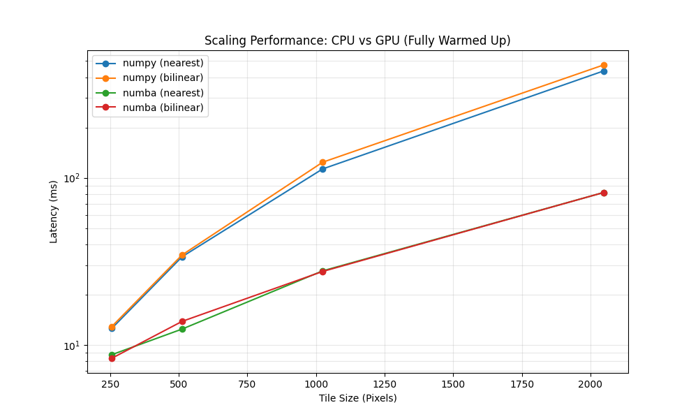
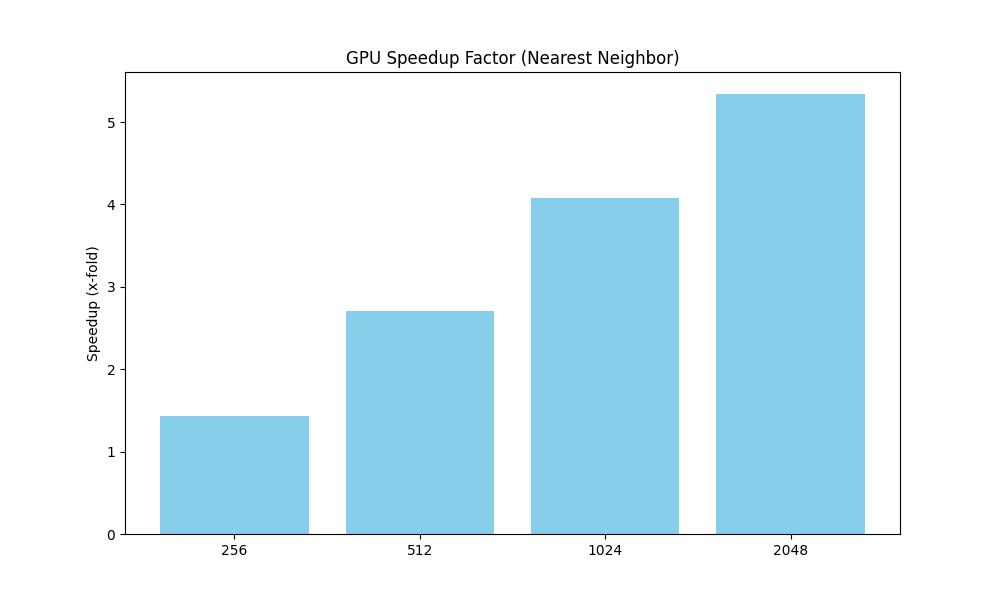

# Performance and Scaling

This page records the benchmark results for Radarmap's tile rendering paths.
The goal is to compare the CPU implementation (`NumPy` + `PyProj`) with the
CUDA implementation (`Numba CUDA`) under the same tile requests.

The numbers below are empirical measurements from the local benchmark script,
not general claims about all deployments. They should be read together with the
benchmark configuration and the raw result files.

## Benchmark Setup

Benchmarks are run through the HTTP tile endpoint against the local backend:

```text
GET /api/tiles/5/16/11.png
```

The benchmark varies:

| Parameter | Values |
| :--- | :--- |
| Tile size | `256`, `512`, `1024`, `2048` |
| Renderer | `numpy`, `numba` |
| Interpolation | `nearest`, `bilinear` |
| Product | `RS` |
| Samples per case | `5` |

The script warms each renderer/interpolation path before collecting timed
samples. The reported results are therefore warmed request latencies, not
process cold-start latencies.

Source files:

- Benchmark script: `run_benchmarks.py`
- Latency data: `benchmark_results.csv`

## Tile Size

The benchmark includes tile sizes that are larger than typical web-map tiles.
This is intentional, but the results should not be interpreted as evidence that
`2048px` tiles are a normal target for the application.

Common raster map tile sizes are smaller:

| Tile size | Practical role |
| :--- | :--- |
| `256px` | Common default for classic raster tile grids. Leaflet and OpenLayers both default to 256px tiles. This is also Radarmap's current backend default because the frontend does not pass a `size` parameter. |
| `512px` | Common for high-DPI raster tiles or MapLibre-style raster sources. A 512px image has four times as many pixels as a 256px image. |
| `1024px` | Useful as a stress case or for special overlays where fewer, larger requests are preferable. Not a typical default for interactive slippy maps. |
| `2048px` | Primarily a stress test for renderer scaling. It creates 16 times as many pixels as a 512px tile and 64 times as many pixels as a 256px tile. |

Large tiles reduce request count, but they also have drawbacks:

- more per-request memory use
- longer single-request latency
- larger encoded PNG payloads
- worse cache granularity
- more work repeated when only part of the viewport changes
- higher risk that one slow request leaves a visible hole in the map

The practical question is therefore not whether the GPU makes `2048px` tiles
fast enough for general use. It usually should not be used that way. The useful
question is whether the GPU keeps latency acceptable when the renderer does more
per-pixel work: larger overlays, high-DPI tiles, bilinear interpolation, temporal
blending, or other data-native operations.

## Cold Start Scope

Cold-start timing is intentionally not included in this report. Measuring it
properly requires each case to start from a fresh backend process, because NumPy,
PyProj, Pillow, the CUDA context, and Numba kernels all have shared process
state. A sequential "first request minus second request" measurement inside one
running process is order-dependent and easy to misread.

If cold-start behavior becomes important, it should be measured as a separate
benchmark:

1. Start a fresh backend process.
2. Send exactly one tile request for the renderer/interpolation case.
3. Send one or more warm requests for comparison.
4. Stop the backend process.
5. Repeat for the next case.

For an interactive service using CUDA, the practical operational requirement is
still clear: warm the CUDA path during process startup if the first user request
should not pay kernel compilation and CUDA context initialization costs.

## Latency Scaling

The warmed-up measurements show that the CUDA path scales better as tile size
increases. At small sizes the fixed overheads are still significant. At larger
sizes the parallel projection and sampling work dominate, and the GPU path pulls
ahead.



| Resolution | NumPy nearest | NumPy bilinear | Numba nearest | Numba bilinear |
| :--- | ---: | ---: | ---: | ---: |
| 256px | 12.56 ms | 12.89 ms | 8.74 ms | 8.32 ms |
| 512px | 33.71 ms | 34.55 ms | 12.44 ms | 13.83 ms |
| 1024px | 113.00 ms | 123.96 ms | 27.73 ms | 27.51 ms |
| 2048px | 436.22 ms | 473.87 ms | 81.69 ms | 81.69 ms |

Using nearest-neighbor interpolation as the common comparison, the observed
speedup grows with tile size:

| Resolution | Speedup |
| :--- | ---: |
| 256px | 1.4x |
| 512px | 2.7x |
| 1024px | 4.1x |
| 2048px | 5.3x |



## Interpolation Cost

Bilinear interpolation has a visible cost on the CPU path at larger tile sizes:

| Resolution | CPU bilinear overhead |
| :--- | ---: |
| 256px | 2.6% |
| 512px | 2.5% |
| 1024px | 9.7% |
| 2048px | 8.6% |

On the CUDA path, nearest and bilinear timings are effectively the same at
`1024px` and `2048px` in this run. That does not mean bilinear interpolation is
free in an absolute sense; it means the additional arithmetic is not the
dominant cost for this kernel and workload.

## Current Bottleneck

After moving projection and sampling work to CUDA, PNG generation becomes a
larger share of end-to-end request time. Internal timing during development has
shown the rendering math below the PNG serialization cost for large tiles.

Approximate split for a large warmed-up tile:

| Stage | Approximate cost |
| :--- | ---: |
| Projection and sampling | ~10 ms |
| PNG serialization | ~65 ms |

This suggests that further latency reductions are unlikely to come from
optimizing the projection kernel alone. The next major change would be to avoid
server-side image serialization and send a numerical buffer to the client for
rendering.

## Interpretation

The CUDA renderer is useful when Radarmap is asked to produce large tiles or
perform higher-fidelity sampling. The benefit is smaller for low-resolution
tiles, where fixed request, transfer, and encoding costs make up more of the
total latency.

The main engineering conclusions are:

- Warm the CUDA path before accepting traffic.
- Keep the CPU renderer as a portable baseline and fallback.
- Treat PNG serialization as the next bottleneck for large tiles.
- Re-run the benchmark after changes to projection math, interpolation,
  serialization, transport format, or hardware.

## Limitations

These measurements are from one local environment and one selected tile. They
are sufficient for comparing renderer behavior within this project, but they are
not a hardware-independent benchmark.

The report should be updated with the exact CPU, GPU, driver, OS, Python, and
package versions when publishing results externally.
